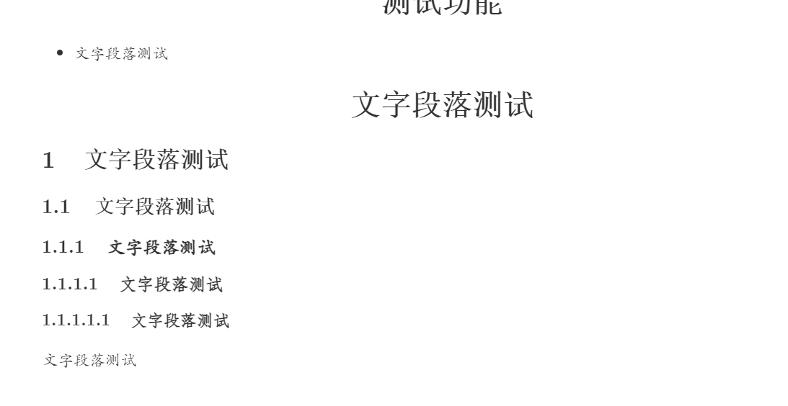

+++
title = 'Test'
date = 2024-03-28T18:01:24+08:00
draft = false
author = ["ArchiBC"]
tags = [ "测试", "无效内容" ]
disableShare = true
description = "测试各种hugo功能的帖子"

[cover]
image = "./assets/"

+++

# 测试功能

* 文字段落测试

# 文字段落测试

## 文字段落测试

### 文字段落测试

#### 文字段落测试

##### 文字段落测试

###### 文字段落测试

文字段落测试

## 图片插入

